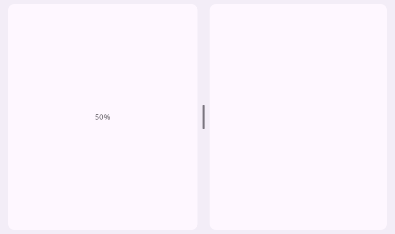

A Flutter package for [Material Design's split panes](https://m3.material.io/foundations/layout/applying-layout/pane-layouts#8b4b4334-e530-4bef-8f89-2631986d33ea).



## Features

- [x] Fixed layouts
- [x] Flexible layouts
- [ ] Specification-accurate animations
- [ ] [Accessibility](https://m3.material.io/foundations/layout/understanding-layout/parts-of-layout#c4619e07-cfc6-4d91-a724-0646126e3911)
- [ ] Flexible layouts relative to custom center/display features
- [ ] API quality (theming, inherited data, etc.)

## Usage

```dart
import 'package:split_pane/split_pane.dart';

Widget build() {
  return SplitPane(
    primary: Placeholder(),
    secondary: Placeholder(),
  );
}
```
